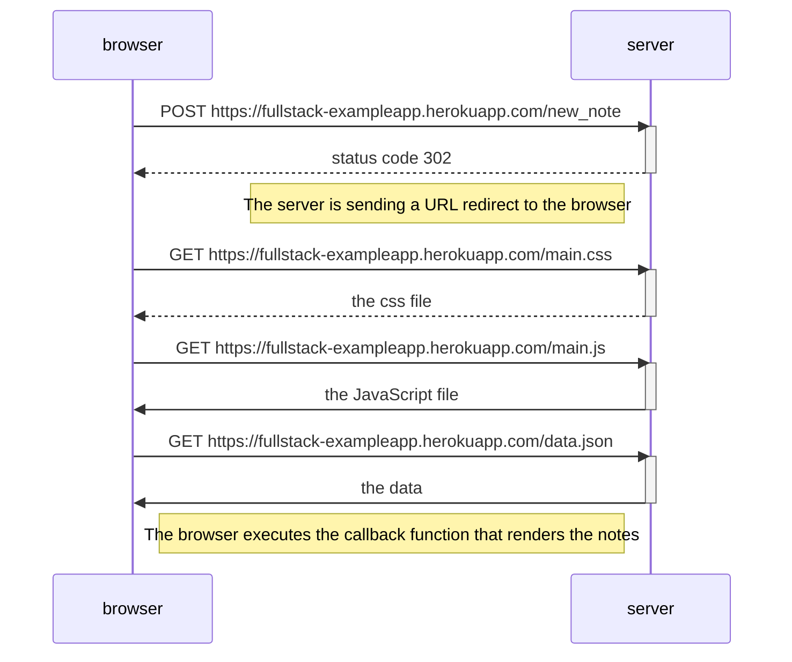
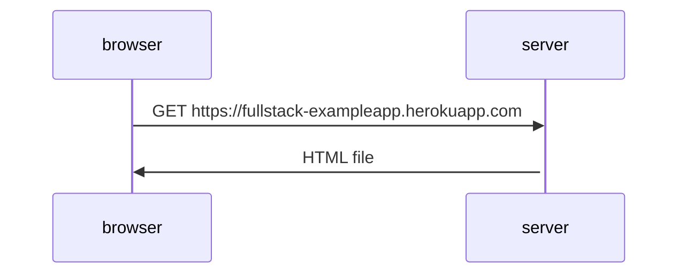
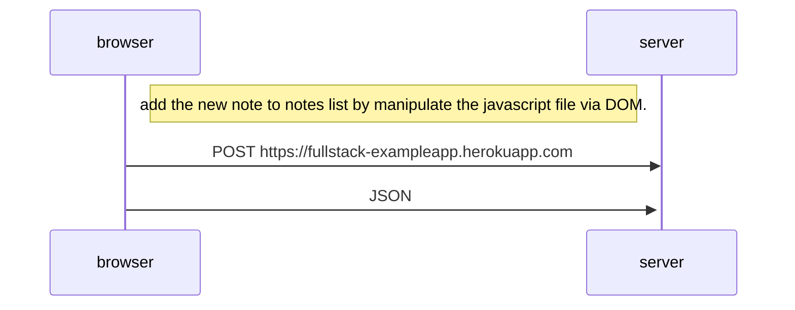

```mermaid
sequenceDiagram
    participant browser
    participant server
    browser->>server: POST https://fullstack-exampleapp.herokuapp.com/new_note
    activate server
    server-->>browser: status code 302
    deactivate server

    Note left of server: The server is sending a URL redirect to the browser

    browser->>server: GET https://fullstack-exampleapp.herokuapp.com/main.css
    activate server
    server-->>browser: the css file
    deactivate server

    browser->>server: GET https://fullstack-exampleapp.herokuapp.com/main.js  
    activate server
    server->>browser: the JavaScript file
    deactivate server

    browser->>server: GET https://fullstack-exampleapp.herokuapp.com/data.json 
    activate server
    server->>browser: the data
    deactivate server

    Note right of browser: The browser executes the callback function that renders the notes
```

```mermaid
%%0.5: single page app diagram
sequenceDiagram
    participant browser
    participant server

    browser->>server: GET https://fullstack-exampleapp.herokuapp.com
    activate server
    server->>browser: HTML file

```

```mermaid
%%0.6: new note in single page app
sequenceDiagram
    participant browser
    participant server

    Note right of browser: add the new note to notes list by manipulate the javascript file via DOM.

    browser->>server: POST https://fullstack-exampleapp.herokuapp.com
    activate server
    browser->>server: JSON 

```

